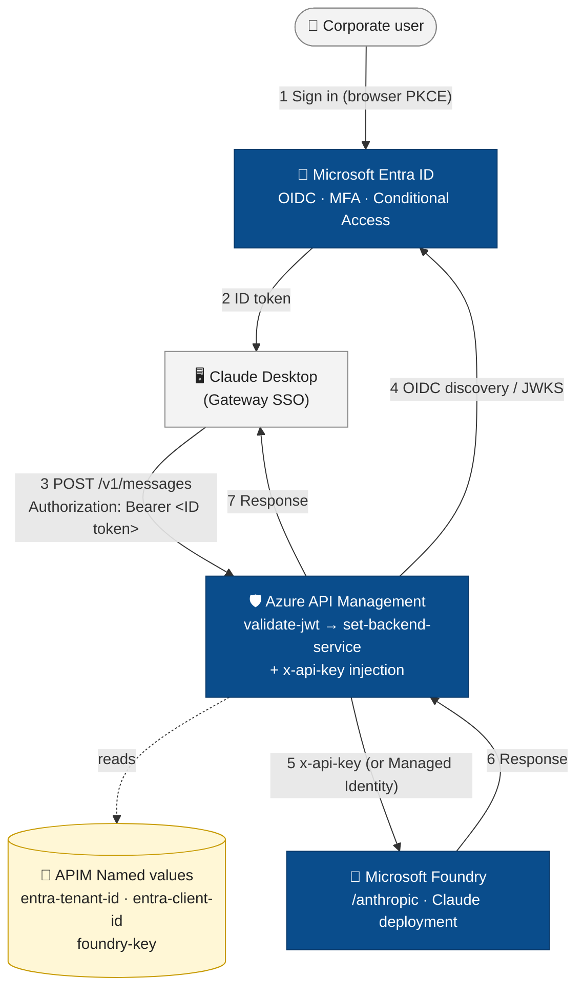

# Claude Desktop → APIM → Microsoft Foundry (Entra ID SSO)

Reference setup that puts **Azure API Management** in front of an **Anthropic Claude** deployment running on **Microsoft Foundry**, with **Entra ID single sign-on** for Claude Desktop users.

## Architecture



In short:

```
Claude Desktop  ──Entra ID bearer──▶  APIM  ──x-api-key──▶  Foundry /anthropic
   (per-user OIDC sign-in)         (validate-jwt)        (Claude model)
```

- End users sign in with their corporate Entra ID account (MFA + Conditional Access apply).
- The Foundry API key lives only inside APIM as a secret Named value — never on user devices.
- APIM `validate-jwt` rejects any token whose `aud` claim isn't the Entra app you register here.

## Repo layout

| Path | What it is |
|---|---|
| [scripts/create-apim.ps1](scripts/create-apim.ps1) | Idempotent PowerShell that provisions the resource group (if needed) and an Azure API Management service to act as the gateway. Run this only if you don't already have an APIM instance. |
| [scripts/register-claude-entra-app.ps1](scripts/register-claude-entra-app.ps1) | Idempotent PowerShell that creates the Entra app registration for Claude Desktop and seeds the APIM Named values (`entra-tenant-id`, `entra-client-id`). |
| [blog/claude-desktop-entra-apim-foundry.md](blog/claude-desktop-entra-apim-foundry.md) | Full walkthrough with screenshots, the inbound policy XML, the Claude Desktop config table, and the gotchas we hit. |
| `.env.example` | Template for the values the scripts need. Copy to `.env`, fill in real values. |
| `.env` | Your local secrets. **Gitignored** — never commit. |
| `.gitignore` | Excludes `.env*` (keeps `.env.example`). |

## Prerequisites

- **Azure subscription** with a Foundry / AI Services account that has a Claude deployment.
- An **API Management instance** — or skip this and run [scripts/create-apim.ps1](scripts/create-apim.ps1) below to provision one.
- Permission to register applications in your Entra tenant.
- **Claude Desktop 1.5.0** or later.
- **Azure CLI** (`az`) installed and logged in to the right tenant.
- **PowerShell 7+** (works on Windows / macOS / Linux).

## Quick start

```powershell
# 1. Copy the template and fill in your real values
Copy-Item .env.example .env
notepad .env

# 2. Log in to the correct tenant
az login --tenant <your-tenant-id>

# 3. (Skip if you already have an APIM service)
#    Provision resource group + API Management service.
.\scripts\create-apim.ps1

# 4. Register the Entra app and push APIM Named values
.\scripts\register-claude-entra-app.ps1
```

`register-claude-entra-app.ps1` prints the new app's **Client ID**. You'll paste that into Claude Desktop in step 5 of the blog.

After the scripts succeed, follow the blog from **Step 2** onward to:
1. Create the APIM API and operations (`POST /v1/messages`, `GET /v1/models`).
2. Add the Foundry API key as a Named value (`foundry-key`).
3. Paste the `validate-jwt` + `set-backend-service` inbound policy.
4. Configure Claude Desktop.

### Don't have an API Management service yet?

Run [scripts/create-apim.ps1](scripts/create-apim.ps1) first. It will:

- Create `RESOURCE_GROUP` in `LOCATION` if it doesn't exist.
- Create the APIM service `APIM_NAME` at SKU `APIM_SKU` (default **Consumption** — provisions in a few minutes; pick `Developer`/`Basic`/`Standard`/`Premium` if you need a dedicated tier, but expect 30-45 min provisioning).
- Print the gateway URL (`https://<apim-name>.azure-api.net`) — that's the base you'll point Claude Desktop at later, with `/claude` appended.

The script is idempotent, so re-running it just verifies the existing service.

## Configuration reference

`.env` keys (see [.env.example](.env.example)):

| Key | Used by | Purpose |
|---|---|---|
| `TENANT_ID` | register-claude-entra-app | Entra tenant the gateway app lives in |
| `SUBSCRIPTION_ID` | both | Azure subscription that owns APIM + Foundry |
| `RESOURCE_GROUP` | both | RG containing (or about to contain) the APIM service |
| `LOCATION` | create-apim | Azure region for new resource group / APIM service |
| `APIM_NAME` | both | API Management service name (globally unique when created) |
| `APIM_SKU` | create-apim | Tier for new APIM service: `Consumption` (default) / `Developer` / `Basic` / `Standard` / `Premium` |
| `APIM_PUBLISHER_EMAIL` | create-apim | Publisher email Azure requires when creating APIM |
| `APIM_PUBLISHER_NAME` | create-apim | Publisher display name (default `Claude Gateway Admin`) |
| `FOUNDRY_ACCOUNT` | reference | Foundry / AI Services account name |
| `FOUNDRY_DEPLOYMENT` | reference | Claude deployment name on Foundry |
| `APP_DISPLAY_NAME` | register-claude-entra-app | Display name for the Entra app registration |
| `REDIRECT_URI` | register-claude-entra-app | Loopback redirect URI (default `http://127.0.0.1/callback`) |

CLI parameters on either script override `.env` values.

## Useful links

- [Gateway single sign-on with your identity provider — Claude.ai Documentation](https://claude.com/docs/cowork/3p/gateway-sso)
- [Configure Claude Desktop with Foundry Models — Microsoft Learn](https://learn.microsoft.com/en-us/azure/foundry/foundry-models/how-to/configure-claude-desktop)

## Security notes

- `.env` is **not** committed. Verify with `git status` before pushing.
- The Foundry API key is **never** in this repo; it's only in the APIM `foundry-key` Named value.
- If a real value accidentally lands in Git history, rotate it (Foundry → Keys → Regenerate) and clean history with `git filter-repo` or BFG.
