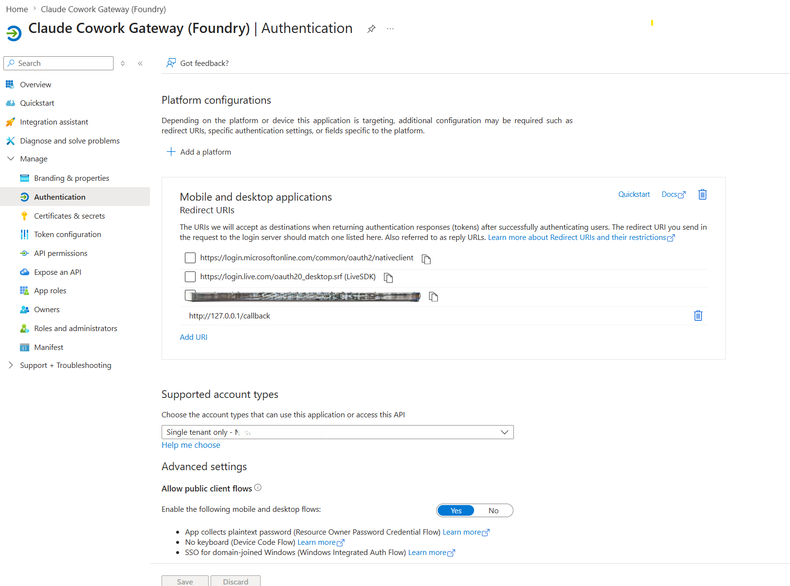
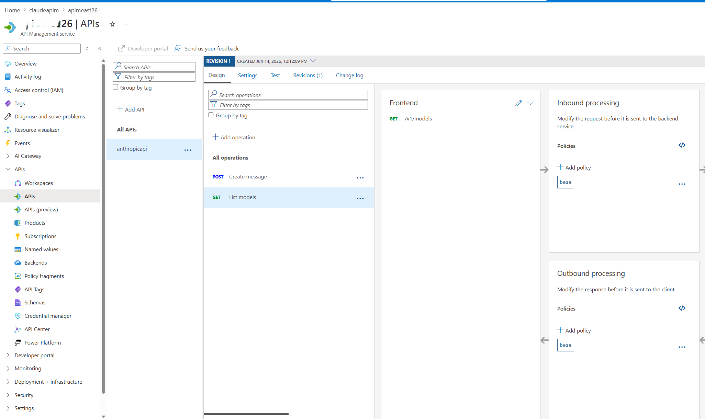
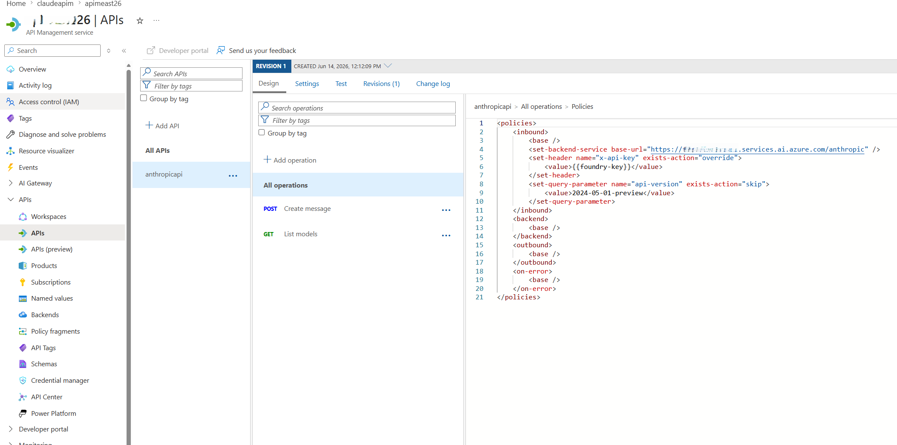
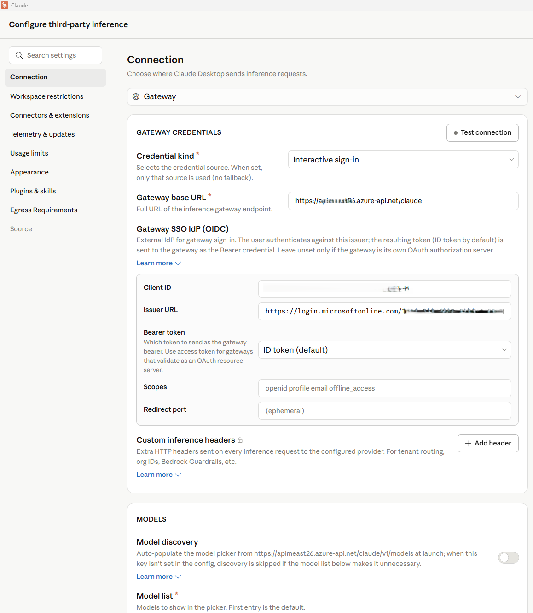
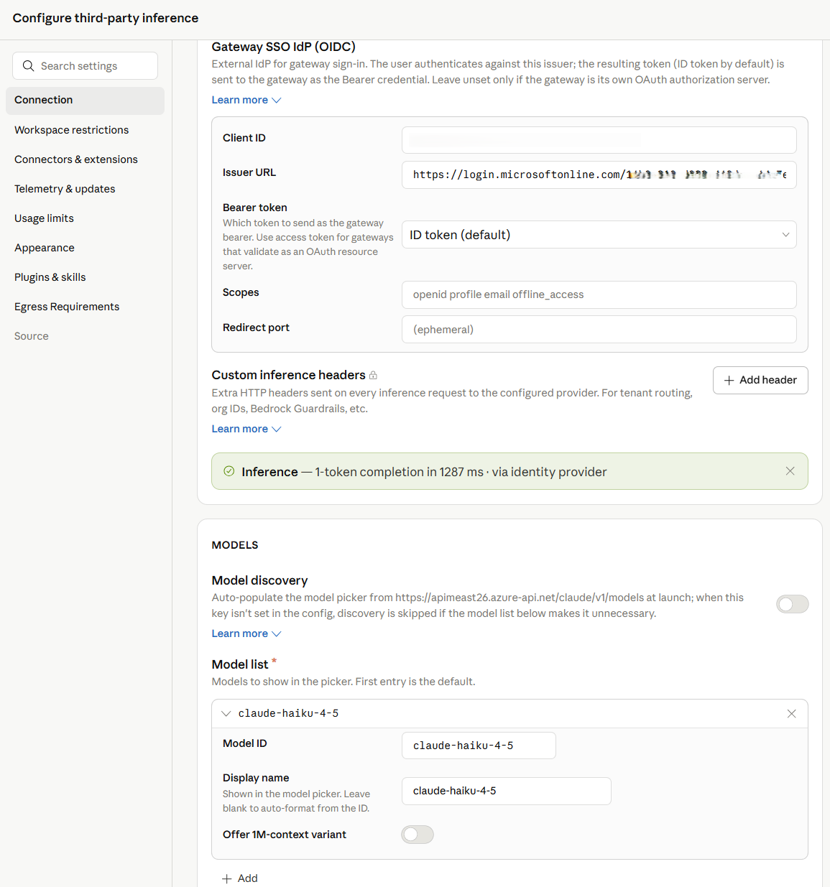
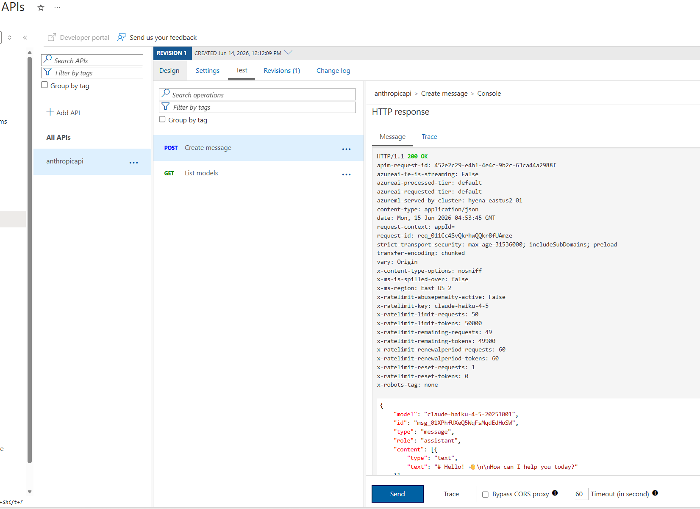

# Enterprise-enabling Claude Desktop with Entra ID, APIM, and Microsoft Foundry (No Backend Required)

*How I put corporate sign-in in front of Claude Desktop without writing a single line of backend code.*


---

## The problem

If your team wants to use **Claude Desktop** with your own Anthropic deployment running on **Microsoft Foundry**, but with a few non-negotiable requirements:

1. **No shared API keys** floating around on developer laptops.
2. **Per-user identity** — every request must be attributable to a real person.
3. **MFA and Conditional Access** must apply, the same way they do for every other internal app.
4. **Central rate-limiting and logging** — one chokepoint we can govern.

Claude Desktop 1.5+ supports a "Gateway SSO" mode where it can sign each user in with OpenID Connect and forward their token to a custom LLM gateway. Azure API Management (APIM) is a perfect fit for that gateway role: it validates the user's Entra ID token, then re-authenticates itself to Foundry behind the scenes.

The end-to-end flow looks like this:

```
Claude Desktop
   │  Authorization: Bearer <Entra ID token from the user's browser sign-in>
   ▼
Azure API Management  (<your-apim>)
   │  ① validate-jwt   → verifies user's Entra ID token
   │  ② re-auths to Foundry with an API key from a Named value
   │  Authorization stripped, x-api-key injected
   ▼
Microsoft Foundry  /anthropic/v1/messages
   │  runs Claude (<your-deployment>)
   ▼
Response back to the user
```

There are no API keys on user devices. Foundry's key lives only inside APIM. And every request carries the user's `oid` claim, so I can build dashboards and per-user quotas later.

---

## What you need before starting

- An **Azure subscription** with a Foundry / AI Services account and a Claude deployment.
- An **API Management** instance, any tier.
- Permission to **register applications in Entra ID** for your tenant.
- **Claude Desktop 1.5.0 or later**.
- Azure CLI installed locally.

Throughout this post I'll use placeholders for resource names:
- `<apim-name>` — your API Management service name
- `<resource-group>` — the resource group that holds it
- `<foundry-account>` — your Foundry / AI Services account name
- `<deployment-name>` — the name of the Claude model deployment on Foundry

---

## Step 1 — Register an Entra ID app for Claude Desktop

This is the OIDC client Claude Desktop signs users into. The Anthropic docs are very specific about the shape it must take: single-tenant, **public PKCE client** (no client secret), and a redirect URI registered under the **Mobile and desktop applications** platform (the only platform Entra allows to use any loopback port).

I scripted it so the setup is one command and idempotent:

```powershell
# scripts/register-claude-entra-app.ps1
[CmdletBinding()]
param(
  [string] $TenantId       = '<your-tenant-id>',
  [string] $SubscriptionId = '<your-subscription-id>',
  [string] $ResourceGroup  = '<resource-group>',
  [string] $ApimName       = '<apim-name>',
  [string] $AppDisplayName = 'Claude Cowork gateway',
  [string] $RedirectUri    = 'http://127.0.0.1/callback'
)

az account set --subscription $SubscriptionId | Out-Null

# 1. Create (or reuse) the app registration
$appId = az ad app list --display-name $AppDisplayName --query "[0].appId" -o tsv
if (-not $appId) {
  $appId = az ad app create --display-name $AppDisplayName `
            --sign-in-audience AzureADMyOrg --query appId -o tsv
}

# 2. Configure as public PKCE client with the Mobile/Desktop redirect URI
$objectId = az ad app show --id $appId --query id -o tsv
$patch = @{
  publicClient = @{ redirectUris = @($RedirectUri) }
  isFallbackPublicClient = $true
} | ConvertTo-Json -Depth 5 -Compress
az rest --method PATCH `
        --uri "https://graph.microsoft.com/v1.0/applications/$objectId" `
        --headers "Content-Type=application/json" --body $patch | Out-Null

# 3. Ensure a service principal exists
$sp = az ad sp list --filter "appId eq '$appId'" --query "[0].id" -o tsv
if (-not $sp) { az ad sp create --id $appId | Out-Null }

# 4. Push two Named values into APIM for the validate-jwt policy
az apim nv create -g $ResourceGroup --service-name $ApimName `
  --named-value-id entra-tenant-id --display-name entra-tenant-id `
  --value $TenantId --secret false
az apim nv create -g $ResourceGroup --service-name $ApimName `
  --named-value-id entra-client-id --display-name entra-client-id `
  --value $appId --secret false

"Client ID: $appId"
```

Run it once. The output prints the **client ID** you'll need in Claude Desktop later, and it leaves two **Named values** in APIM (`entra-tenant-id`, `entra-client-id`) that the gateway policy will reference.



> ⚠️ Common pitfall: if the redirect URI ends up under the **Web** platform instead of **Mobile and desktop applications**, Entra will demand a client secret on token exchange — Claude won't send one and you'll get `Token exchange failed (HTTP 401)`. The app type can't be changed after creation, so create a new app if that happens.

---

## Step 2 — Create the API in APIM

In the portal under **APIM → APIs → + Add API → HTTP**:

| Field | Value |
|---|---|
| Display name | Anthropic API |
| Name | `anthropicapi` |
| Web service URL | `https://<foundry-account>.services.ai.azure.com/anthropic` |
| API URL suffix | `claude` |
| Subscription required | **Off** (Entra ID is our only credential) |

Add two operations under it:

| Method | URL | Display name |
|---|---|---|
| POST | `/v1/messages` | Create message |
| GET  | `/v1/models`   | List models |

The `/v1/models` operation isn't strictly needed (Foundry's Anthropic surface doesn't implement it), but having it registered means you can decide later whether to stub it out or proxy it.



---

## Step 3 — Add an API key for Foundry as a Named value

APIM → **Named values → + Add**:

- Name: `foundry-key`
- Type: **Secret**
- Value: paste a key from the Foundry account's *Keys and Endpoint* blade.

This is the only place the key ever lives. Clients never see it.

> **Alternative — keyless with Entra ID (managed identity):** If you prefer not to manage a Foundry key at all, enable the APIM instance's **system-assigned managed identity** (APIM → *Identity → System assigned → On*), then grant that identity the **Foundry User** role on the Foundry account (role ID `53ca6127-db72-4b80-b1b0-d745d6d5456d` — previously named *Azure AI User*; Microsoft renamed it but the ID and permissions are unchanged). In Step 4, replace the `set-header` that injects `x-api-key` with:
>
> ```xml
> <authentication-managed-identity resource="https://cognitiveservices.azure.com" output-token-variable-name="foundry-token" />
> <set-header name="Authorization" exists-action="override">
>   <value>@("Bearer " + (string)context.Variables["foundry-token"])</value>
> </set-header>
> ```
>
> Then you can skip the `foundry-key` Named value entirely. Don't use the legacy `Cognitive Services User` role — per the Foundry RBAC doc, roles starting with *Cognitive Services* don't apply to Foundry scenarios.

---

## Step 4 — Write the gateway policy

This is the heart of the whole setup. Open APIs → **anthropicapi → All operations → Inbound processing → </>** and paste:

```xml
<policies>
  <inbound>
    <base />

    <!-- USER → APIM: verify Entra ID token from Claude Desktop -->
    <validate-jwt header-name="Authorization"
                  failed-validation-httpcode="401"
                  failed-validation-error-message="Unauthorized"
                  require-scheme="Bearer">
      <openid-config url="https://login.microsoftonline.com/{{entra-tenant-id}}/v2.0/.well-known/openid-configuration" />
      <audiences>
        <audience>{{entra-client-id}}</audience>
      </audiences>
      <issuers>
        <issuer>https://login.microsoftonline.com/{{entra-tenant-id}}/v2.0</issuer>
      </issuers>
    </validate-jwt>

    <!-- APIM → Foundry -->
    <set-backend-service base-url="https://<foundry-account>.services.ai.azure.com/anthropic" />
    <set-header name="x-api-key" exists-action="override">
      <value>{{foundry-key}}</value>
    </set-header>
    <set-query-parameter name="api-version" exists-action="skip">
      <value>2024-05-01-preview</value>
    </set-query-parameter>
  </inbound>
  <backend><base /></backend>
  <outbound><base /></outbound>
  <on-error><base /></on-error>
</policies>
```

Two things to notice:

- `validate-jwt` uses the **OIDC discovery URL** — JWKS keys are fetched and cached automatically. It rejects any token whose `aud` claim is not the client ID of our Entra app, which is exactly what we want.
- The `Authorization` header from the user is **not forwarded** — once `validate-jwt` succeeds, the request is re-authenticated to Foundry with `x-api-key`. No user token ever leaves APIM.



---

## Step 5 — Configure Claude Desktop

Open Claude Desktop → **Configure third-party inference** and fill it in like this:

| Field | Value |
|---|---|
| Connection | Gateway |
| Credential kind | Interactive sign-in |
| Gateway base URL | `https://<apim-name>.azure-api.net/claude` |
| Client ID | (the appId your script printed) |
| Issuer URL | `https://login.microsoftonline.com/<tenant-id>/v2.0` |
| Authorization URL / Token URL | leave empty |
| Bearer token | ID token (default) |
| Scopes | leave default (`openid profile email offline_access`) |
| Redirect port | leave empty (ephemeral) |
| Model discovery | **Off** |
| Model list → Model ID | `<deployment-name>` (your Foundry deployment name) |

> ℹ️ **Why Model discovery is Off** — Claude Desktop's discovery uses `GET /v1/models`, and the Foundry `/anthropic` surface doesn't implement that endpoint, so it 404s. Listing the model manually skips the call entirely.
>
> **If you want to leave Model discovery On**, stub `/v1/models` in APIM. Add a `GET /v1/models` operation to your API and give it this inbound policy that returns an Anthropic-shaped response without ever hitting the backend:
>
> ```xml
> <policies>
>   <inbound>
>     <base />
>     <return-response>
>       <set-status code="200" reason="OK" />
>       <set-header name="Content-Type" exists-action="override">
>         <value>application/json</value>
>       </set-header>
>       <set-body>@{
>         return new JObject(
>           new JProperty("data", new JArray(
>             new JObject(
>               new JProperty("id", "<deployment-name>"),
>               new JProperty("type", "model"),
>               new JProperty("display_name", "Claude on Foundry"),
>               new JProperty("created_at", "2026-01-01T00:00:00Z")
>             )
>           )),
>           new JProperty("has_more", false),
>           new JProperty("first_id", "<deployment-name>"),
>           new JProperty("last_id",  "<deployment-name>")
>         ).ToString();
>       }</set-body>
>     </return-response>
>   </inbound>
>   <backend><base /></backend>
>   <outbound><base /></outbound>
>   <on-error><base /></on-error>
> </policies>
> ```
>
> Add one entry per deployment you want to expose. The benefit of stubbing rather than turning discovery off is that adding new models becomes a policy edit — no need to re-export and redeploy Claude Desktop config to every user.



Click **Apply Changes** then **Sign in to your organization**. Your browser opens to the normal Entra sign-in page; once approved you're returned to the app, and a quick connection test runs.

The success indicator is a small green banner:

> ✅ Inference — 1-token completion in 1449 ms · **via identity provider**



For broader rollout, hit the **Export** button at the top of the configuration window — it produces a `.mobileconfig` (macOS) or `.reg` (Windows) you can push via Intune / Jamf to every user's machine.

---

## Step 6 — Verify both hops

In APIM → **APIs → anthropicapi → Test → POST /v1/messages** I sent:

```http
Headers:
  anthropic-version: 2023-06-01
Body:
  { "model": "<deployment-name>", "max_tokens": 64,
    "messages": [{"role":"user","content":"hi"}] }
```

Click **Send → Trace**, and look at two places:

- **Inbound → validate-jwt**: should say `succeeded` and show the decoded claims (your `oid`, `email`, etc.).
- **Backend → Request**: outbound URL is `https://<foundry-account>.services.ai.azure.com/anthropic/v1/messages?api-version=2024-05-01-preview`, with `x-api-key: ****` present and `Authorization` absent.
- **Backend → Response**: 200, with a Claude message JSON body.

That confirms both halves of the chain.



---

## Bumps I hit along the way

A few errors that cost me a few minutes each — sharing so you can skip them:

| Symptom | Cause | Fix |
|---|---|---|
| Claude shows *"Your provider's model list hasn't loaded yet"* and `/v1/models` returns 404 | Foundry's Anthropic surface doesn't implement that endpoint | Turn **Model discovery OFF** in Claude Desktop and add the deployment name manually |
| Claude shows *"Authentication failed"* even though sign-in worked | The APIM API still had **Subscription required = ON**, blocking the call before `validate-jwt` ran with `401: Access denied due to missing subscription key` | Uncheck **Subscription required** on the API |
| Portal Test panel shows *"Cannot read properties of undefined (reading 'statusCode')"* | The test console doesn't attach an Entra token, so `validate-jwt` 401s and the panel's JavaScript crashes | Comment out `<validate-jwt>` temporarily for portal testing, or test via `curl` with a real token |
| `OIDC discovery failed (HTTP 404)` in Claude Desktop | Pasted the metadata URL into **Issuer URL** | Issuer must end at `/v2.0`, not at `/.well-known/openid-configuration` |
| `Token exchange failed (HTTP 401)` | App registered under **Web** platform instead of **Mobile and desktop applications** | Create a new app with the right platform — it can't be changed |

---

## Where this leaves us

- Every Claude Desktop user authenticates against **Entra ID** in their browser, just like Office or Teams. MFA and Conditional Access policies apply automatically.
- The **Foundry API key** lives only inside APIM as a secret Named value. It's never on a developer laptop.
- APIM logs carry the user's Entra `oid` claim, which I'll use next to build per-user dashboards and token-bucket quotas (`llm-token-limit` keyed off `oid`).
- If we ever want to remove the API key entirely, the same setup switches to APIM **system-assigned managed identity** with `<authentication-managed-identity resource="https://cognitiveservices.azure.com" />` plus a single RBAC assignment on the Foundry account: the **Foundry User** role (role ID `53ca6127-db72-4b80-b1b0-d745d6d5456d`, formerly *Azure AI User*). See the [Foundry RBAC doc](https://learn.microsoft.com/en-us/azure/foundry/concepts/rbac-foundry?tabs=owner) — don't use any `Cognitive Services *` roles for Foundry. For now the key model is fine.

---

## What I'd add next

- **`llm-token-limit`** and **`llm-emit-token-metric`** policies for per-user quotas and cost visibility.
- **App Insights** wiring on the API, with a workbook that pivots on the `oid` claim.
- **Assignment required = Yes** on the Entra Enterprise Application + a security group, so only approved users can sign in.
- **Intune deployment** of the exported `.reg` / `.mobileconfig` so the gateway URL and client ID land on devices automatically.

But that's all incremental. The hard part — getting Claude Desktop, Entra ID, APIM, and Foundry to agree on who's allowed to talk to whom — is done. Total elapsed: about an afternoon, most of it spent learning where each portal hides its switches.

---

## Useful links

- [Gateway single sign-on with your identity provider — Claude.ai Documentation](https://claude.com/docs/cowork/3p/gateway-sso)
- [Configure Claude Desktop with Foundry Models — Microsoft Learn](https://learn.microsoft.com/en-us/azure/foundry/foundry-models/how-to/configure-claude-desktop)
- [Role-based access control for Microsoft Foundry — Microsoft Learn](https://learn.microsoft.com/en-us/azure/foundry/concepts/rbac-foundry?tabs=owner)
